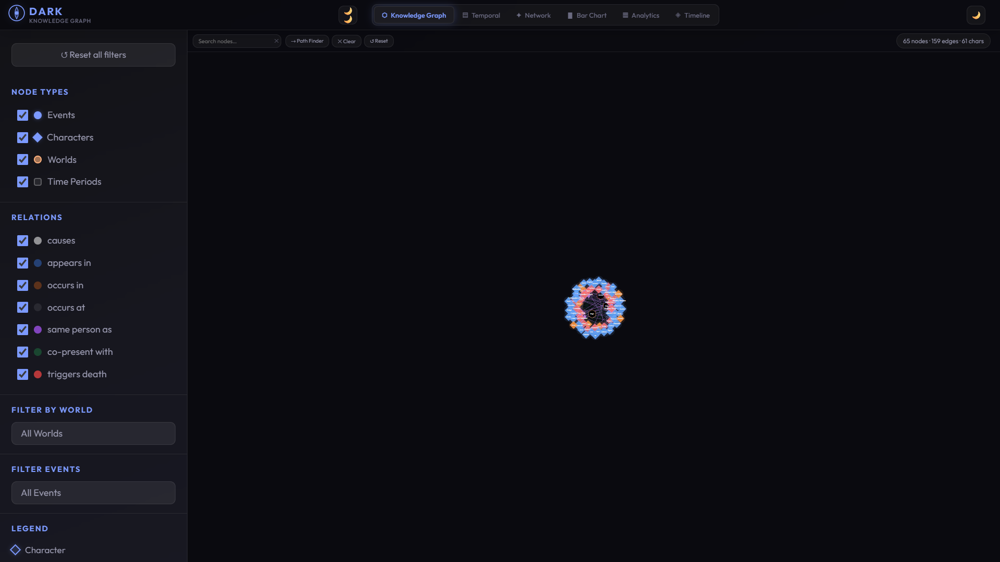
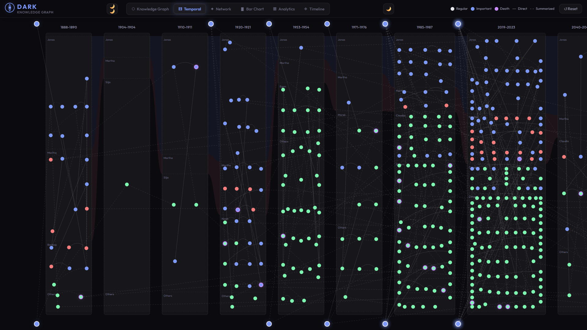
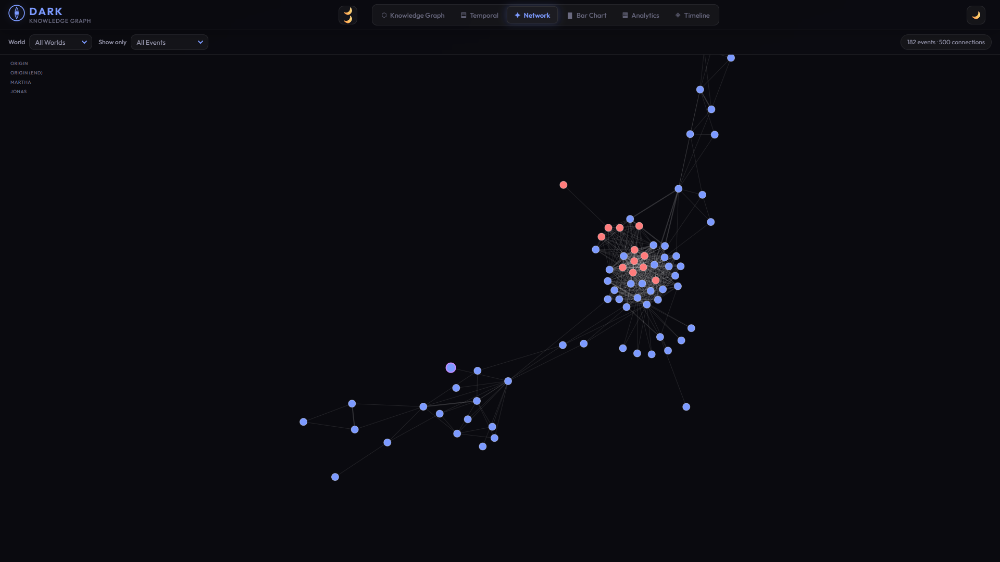
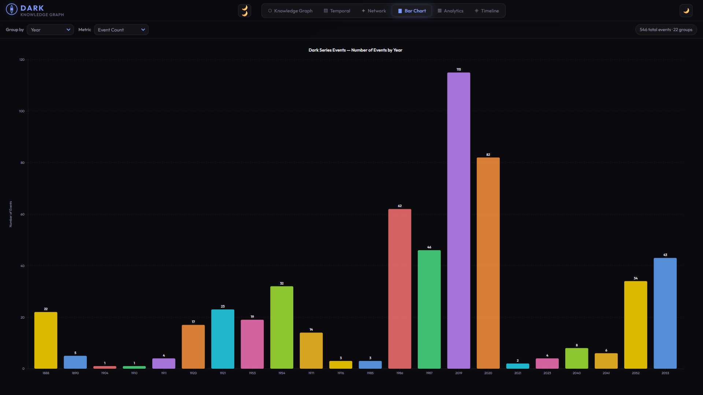
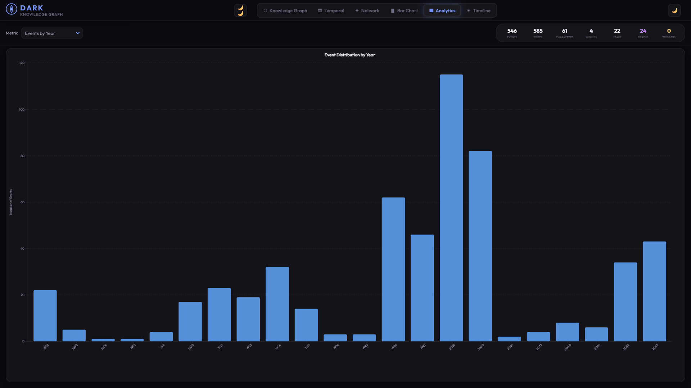
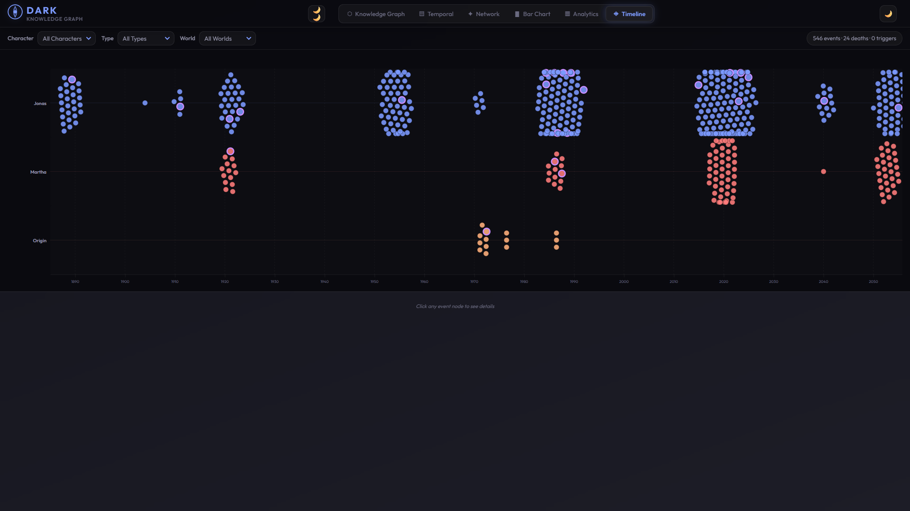

# Dark Series -- Knowledge Graph Visualization

Interactive web application for exploring the temporal, causal, and character-based relationships of the television series *Dark* (Netflix, 2017--2020). Transforms flat CSV data into a typed Knowledge Graph and provides six coordinated visualization views with a clean glassmorphic UI.

---

## UI Walkthrough

### Step 1 — Knowledge Graph (default view)
The main view. A force-directed graph with 4 node types: **Event** (circles, colored by world), **Character** (diamonds, sized by appearance), **World** (hexagons), and **TimePeriod** (pills). 8 edge types connect them. The left sidebar contains filters, toggles, legend, and the entity inspector panel.

---

### Step 2 — Temporal Graph
Swimlane-based timeline where events are grouped into time-boxes (clustered by year proximity). Smooth Bezier curves show causal transitions between events across adjacent time windows.

---

### Step 3 — Network Graph
Event-centric force layout. Events are linked when they share one or more characters. Node size encodes importance (number of connected events). Filterable by world and event type.

---

### Step 4 — Bar Chart
Grouped vertical bars with configurable grouping (by **year**, **world**, or **top characters**) and selectable metrics (**event count**, **death events**, **important triggers**). Animated D3 transitions on filter change.

---

### Step 5 — Analytics Dashboard
Summary dashboard showing 7 key stat cards (total events, characters, worlds, deaths, triggers, etc.) plus 4 chart types: events-by-year bar, edge-type donut, top-20 character involvement bar, and events-by-world distribution pie.

---

### Step 6 — Timeline
Beeswarm-per-lane layout across World bands covering 1885--2056. Each row is a world (Jonas, Martha, Origin). Dots are events — click any dot to see details in the bottom detail panel. Filterable by character, event type, and world.

---

## How to Run

1. Serve the project directory: `python -m http.server 8000`
2. Open `http://localhost:8000` in a browser.
3. A local server is required; `file://` will not work due to CORS restrictions on XHR-based CSV loading.

## Author
Abdullah Al Mamun  
M.Sc. & B.Sc. in Software Engineering  
TU Wien (Vienna, Austria) & Daffodil International University  
Email: mamun.swe.de@gmail.com  
GitHub: [github.com/abbysweb](https://github.com/abbysweb)  
ORCID: [0009-0006-7473-0024](https://orcid.org/0009-0006-7473-0024)
